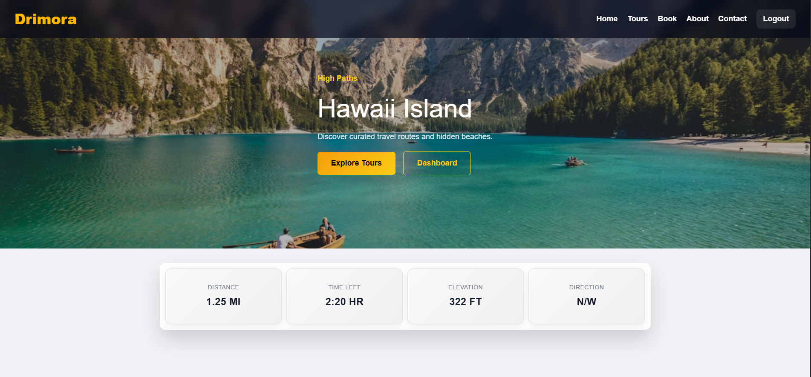
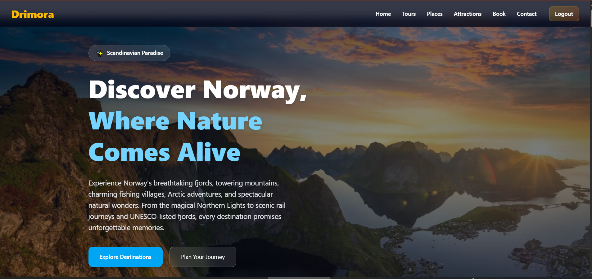
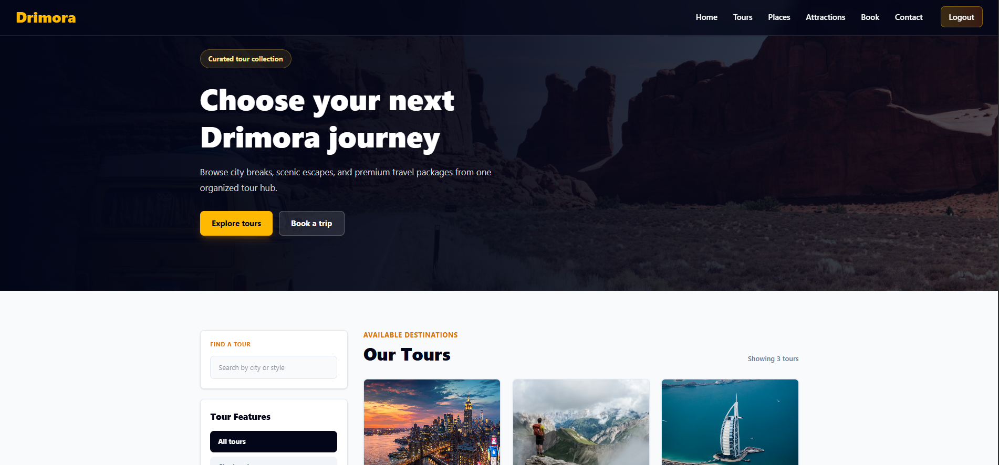

<p align="center">
  
</p>

<h1 align="center">🌍 DRIMORA</h1>

<p align="center">
  <strong>Explore • Dream • Discover</strong>
</p>

<p align="center">
  A modern, responsive Tour & Travel Website built with HTML, Tailwind CSS and JavaScript.
</p>

<p align="center">
  <a href="https://developwithanuj.github.io/tour-blog-website/">🌐 Live Demo</a> •
  <a href="https://github.com/DevelopWithAnuj/tour-blog-website">⭐ Repository</a>
</p>

<p align="center" style="display:flex;">


</p>


## 📖 About

Drimora is a modern travel website designed to help travelers discover amazing destinations around the world.

The website includes destination pages, travel guides, itineraries, galleries, booking interface, FAQs, maps, and responsive layouts for all devices.

## ✨ Features

- Beautiful Landing Page
- Responsive Design
- Modern Tailwind UI
- Destination Pages
- Search Functionality
- Travel Guides
- Interactive Maps
- Image Gallery
- FAQ Section
- Contact Form
- Smooth Animations
- Mobile Friendly
- Dark Mode (if available)


## 📸 Screenshots

### Home Page



### Norway Page



### Destination Details




## 🛠 Tech Stack

HTML5

Tailwind CSS

JavaScript (ES6)

Leaflet.js

OpenStreetMap

Font Awesome

AOS Animation

Swiper.js

## 📂 Folder Structure

```text
Drimora/
├── assets/
│   ├── images/
│   ├── videos/
│   └── icons/
├── css/
├── js/
├── pages/
│   ├── norway.html
│   ├── new-york.html
│   └── japan.html
├── index.html
└── README.md
```


## 🌎 Pages

- Home
- About
- Destinations
- Norway
- New York
- Japan
- Contact
- Gallery
- FAQ


git clone https://github.com/yourusername/drimora.git

cd drimora

Open:
index.html


## 🎯 Goals

✔ Responsive Design

✔ Fast Loading

✔ SEO Friendly

✔ Easy Navigation

✔ Premium UI

✔ Accessible Design


## 📱 Responsive

Desktop

Laptop

Tablet

Mobile


## 🌍 Destinations

🇳🇴 Norway

🇺🇸 New York

🇯🇵 Japan

🇫🇷 France

🇮🇹 Italy

🇨🇭 Switzerland


## 📊 Website Includes

20+ Sections

100+ Images

Responsive Layout

Modern Components

Interactive Map

Destination Guides

Travel Tips

Booking UI


## 📊 Website Includes

20+ Sections

100+ Images

Responsive Layout

Modern Components

Interactive Map

Destination Guides

Travel Tips

Booking UI


## 🤝 Contributing

Pull requests are welcome.

For major changes, please open an issue first.


## 📄 License

MIT License


## 👨‍💻 Author

Anuj Prajapati

GitHub
LinkedIn
Portfolio


If you like this project,

⭐ Star this repository.
=======
